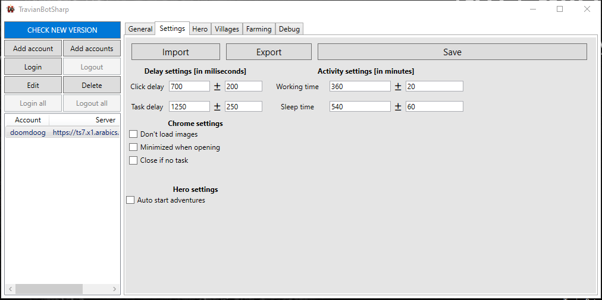

Account's settings
=======

Delay settings
--------------

* Click delay (ms): The delay between each click. This is useful to avoid being detected by the server. The default value is 700 ms.
* Task delay (ms): The delay between each task. This is useful to avoid being detected by the server. The default value is 1250 ms.

Activity settings
--------------

* Working time (min): The time the bot will work before sleeping. The default value is 360 minutes. (6 hours)
* Sleep time (min): The time the bot will sleep before working again. The default value is 540 minutes. (9 hours)

.. note::
    If your account has multiple proxies, bot will check next proxy and use that instead of sleeping.
    Becareful when set these time, if you set too short time, Multihunter will hunt you down.

Chrome settings
--------------

* Don't load images: This will reduce data used if account is using proxy
* Minimized when opening: This will minimize the browser when the bot is starting
* Close if no task: This will close the browser if there is no task to do

.. note::
    Feature ("Close if no task") is not working for now, it will be fixed in next version

Hero settings
--------------

* Auto start adventures: This will start adventure automatically after you login

Buttons
--------------

* Import button: Load you settings from file
* Export button: Save your settings to file 
.. note::
    You need to save setting before you can export it
    
* Save button: When you are done with the settings, don't forget to click the save button to save the settings.