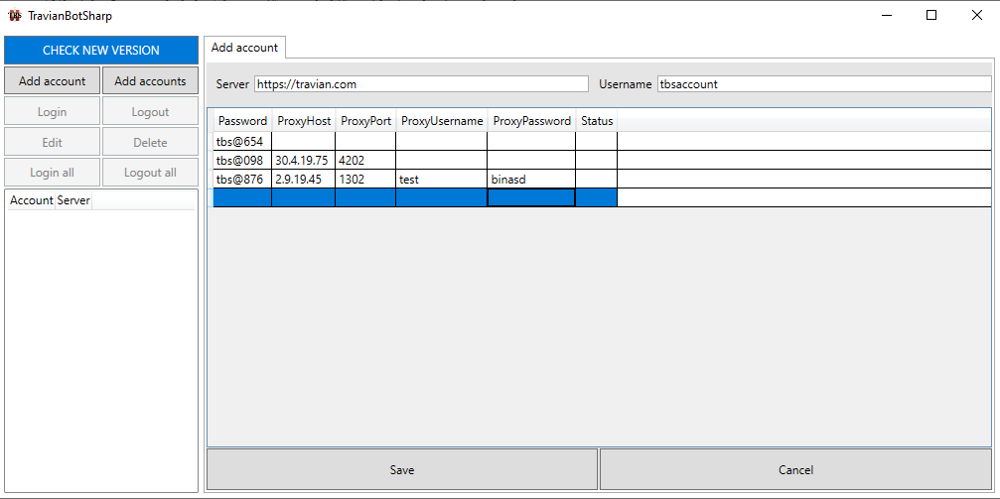
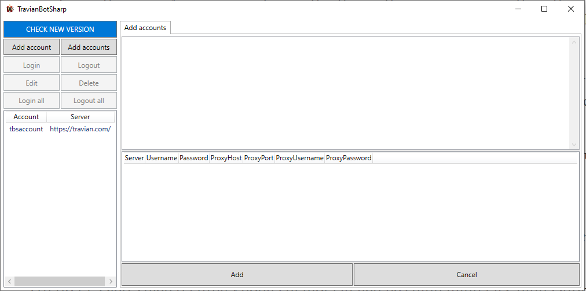
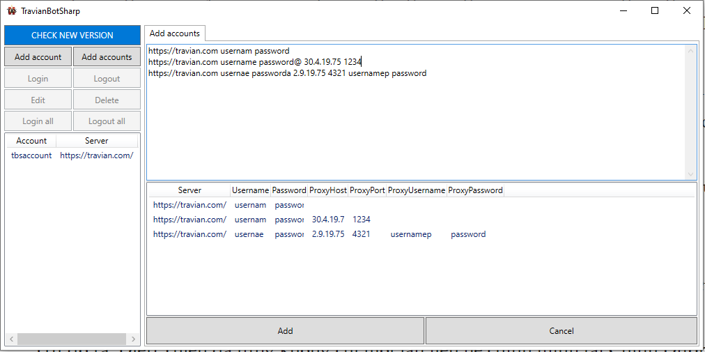
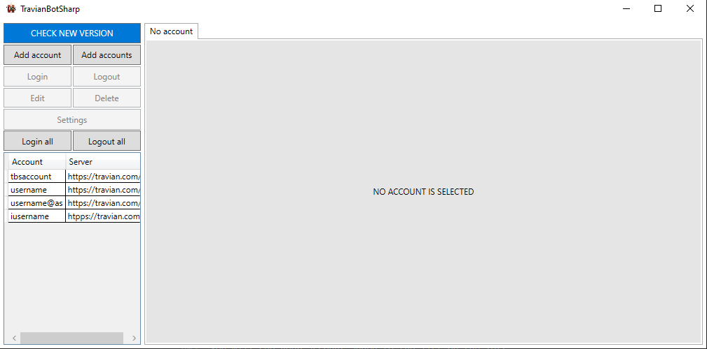

Add account
===========

Add single account
------------------

1. Step 1:

Click on the **Add account** button.

2. Step 2:

Fill your account information.

.. note::

Make sure your server url has *https://* or *http://* at the beginning.

3. Step 3:

Click save button.

You will see your account added to the list on the left.

Add multiple accounts
---------------------

1. Step 1:

Click on the **Add Accounts** button.

2. Step 2:

Fill your account information.

.. note::

Make sure your server url has *https://* or *http://* at the beginning.
After finish one account, please press **space** or **enter** to update account table.

3. Step 3:

Click save button.

You will see your account added to the list on the left.

