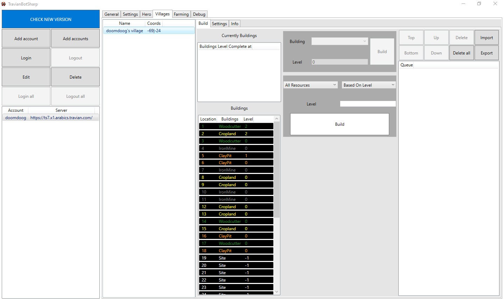
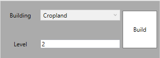
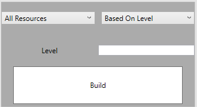

Auto builder
=======

Currently buildings
--------------

Show current queue ingame. ( Just for info )

Buildings 
--------------

Show buildings in resource & building page.

.. note::

    You can update these manually by clicking buttons on Villages>Info tab.

Queue 
--------------

Show planned building, TBS will choose from these buildings to build.

.. note::

    It is a good idea when you create your own queue without login account.

Add building to queue 
--------------

Add single building
^^^^^^^^^^^^^^

* Choose building position in buildings table.
* If that is site, it means there is not building there, so you can choose what building you want.
* Enter level you want and click build.
* Your building will be show in queue table

Add multiple resource fields
^^^^^^^^^^^^^^

* Choose what resource fields you want ( All resources/Exclude crop/Only crop )
* Choose order you want ( Based on level - low level build first / based on resource - low resource in storage build first ) 
* Enter level you want and click build. 
* Your building will be show in queue table
