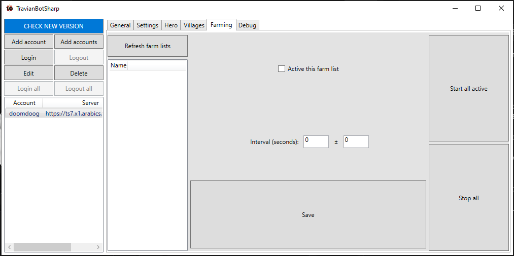

Account's settings
=======

.. note::

    This feature only works when you click on the Start all active button
    TBS won't start automatically the farming process after you login account like the old one

Scan farmlist from rallypoint
--------

After clicking on **Refresh farms list**, TBS will add **refresh farm list task** to queue ( you can see it at Debug tab)

.. note::

    Sometime GUI didn't update. You can switch to another tab and go back to manually update.

Setting farmlist
--------

Click on the farmlist you want and modify its settings

* **Active this farm list**:  active or not this farm list
* **Interval**: interval between each farming process
* **Save** button: When you are done with the settings, don't forget to click the save button to save the settings.

.. note::

    Farmlist is active will be green while inactive will be red

Buttons 
--------

* **Start all active**: TBS will add **start farm list** to queue (you can see them at Debug tab)
* **Stop all**: TBS will remove all task **start farm list** from queue

