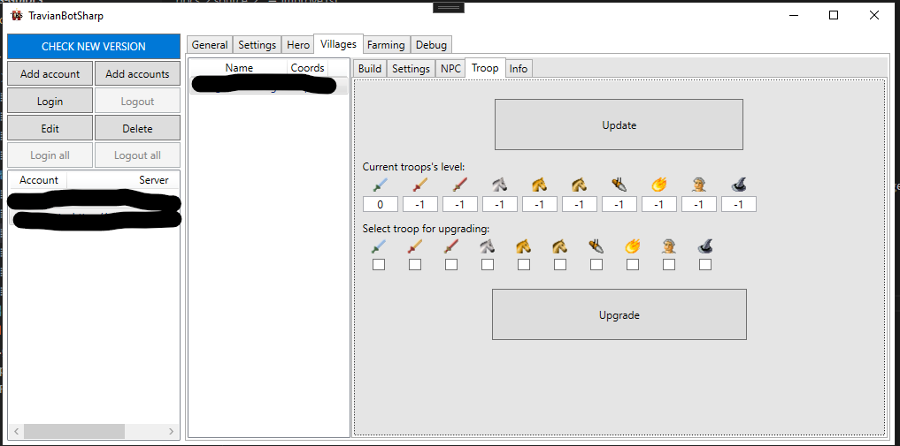

Improve
=======

TBS will continue imrpove troop until its level is 20 or equal to Smithy's level.

Works best on `TTwars <https://ttwars.com>`_

Auto improve
--------------

TBS will check troop can improve everytime it goes to Buildings page.

Tick on Auto improve troop and choose your troop you want and press Save

.. note::

    Troop which is not researched will be untick
    You have to manually update which troop account researched (Check bellow)
    Please ignore settle and chief, they cannot improve, please don't tick on them

Manually improve
--------------

Press Update to let bot go into Smithy and check troop's level

.. note::

    Troop's level is -1 means "not researched"

Choose troop you want by ticking on box and press Upgrade

.. note::

    This will add improve task to queue but don't repeat. 
    Use this when your Smithy is level 20.