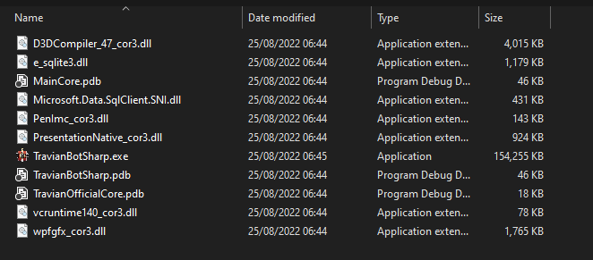

Install
=======

System requirements
-------------------

TBS is made to run on **Windows** only. (Linux or MacOS are in planning)

TBS need **Google Chrome** to open Travian game, make sure install it first.

Download
--------------

1. Download the latest version of TBS from `here <https://github.com/Erol444/TravianBotSharp/releases/latest>`_
2. Choose your version you want

* TravianOfficial-NewHeroUI: for Official server has new hero UI 
* TravianOfficial-OldHeroUI: for Official server has old hero UI
* TTWars: for TTWars server

3. Extract the zip file to a folder

Open bot
--------

After extracting the archive, you will get these file.

Run **TravianBotSharp.exe** to open bot.

.. note::
    In the first time, TBS will load longer as normal, please wait patiently.